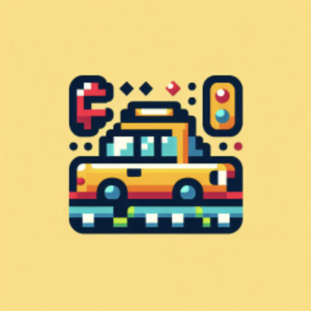

# Taxi Break Game

A fun casual 2D game written in Flutter using [Flame Engine](https://flame-engine.org). 
You play as a taxi driver trying to pick up passengers and deliver them to their destinations while avoiding obstacles and other drivers in the city.

## Getting Started
To get started with the Taxi Break Game, follow these steps:
1. Clone or download the repository to your local machine.
2. Open the project in your preferred IDE or text editor.
3. Install the required dependencies by running `flutter pub get` in the project directory.
4. Run the game by pressing the play button or by using the corresponding keyboard shortcut (e.g. F5 on Windows, Command+R on macOS).
5. Enjoy playing the game!

## Features
The Taxi Break Game has the following features:
- Challenging and exciting arcade-like gameplay
- Levels difficulty growing upon players progress
- Retro-console 2D graphics
- Fun and catchy music and sound effects

## License
The Taxi Break Game is licensed under the MIT License. See the LICENSE file for more details.
